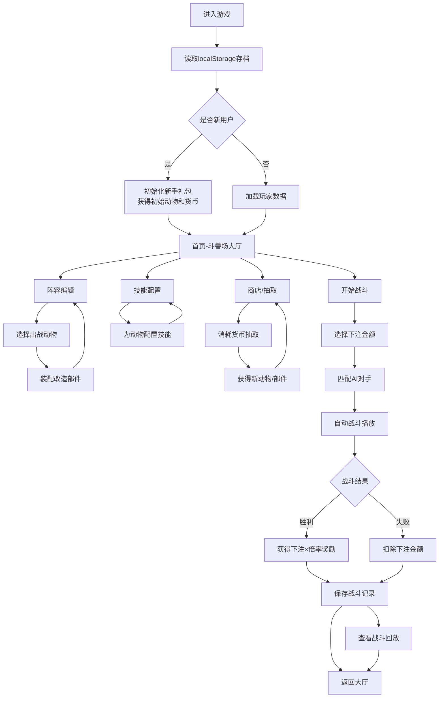

## 1. 产品概述

霓虹斗兽场是一款赛博朋克风格的H5自动战斗游戏，玩家收集并改造流浪动物组建战斗阵容，在霓虹闪烁的地下斗兽场中进行自动对战并下注获取收益。游戏纯前端运行，无需后端支持。

- 核心玩法：收集改造流浪动物 → 配置技能与阵容 → 下注自动战斗 → 获得货币奖励 → 强化升级
- 目标用户：喜爱策略养成和放置类游戏的玩家，喜欢赛博朋克/霓虹美学的用户

## 2. 核心功能

### 2.1 功能模块

1. **首页**：游戏主入口，斗兽场大厅，快速匹配战斗，货币显示
2. **阵容编辑**：管理已拥有的动物，装配改造部件，调整出战顺序
3. **技能配置**：为动物装备技能，升级技能等级，查看技能图鉴
4. **战斗页面**：实时自动战斗，下注系统，战斗特效，胜负结算
5. **战斗回放**：查看历史战斗记录，重播战斗过程
6. **成长系统**：货币管理，动物抽取，部件商店，升级强化

### 2.2 页面详情

| 页面名称 | 模块名称 | 功能描述 |
|---------|---------|----------|
| 首页 | 斗兽场大厅 | 展示当前货币、快速战斗入口、阵容预览、战斗记录入口 |
| 阵容编辑 | 动物列表 | 展示所有动物卡片，选择出战单位，显示属性数值 |
| 阵容编辑 | 改造装配 | 为动物装备机械部件，提升属性，改变外观 |
| 技能配置 | 技能槽位 | 为每个动物配置最多3个技能，显示技能效果和冷却 |
| 技能配置 | 技能升级 | 消耗货币升级技能，提升技能威力 |
| 战斗页面 | 战斗场景 | 左右两侧对战阵容，血条显示，自动战斗动画 |
| 战斗页面 | 下注系统 | 战斗前选择下注金额，胜利获得倍率奖励 |
| 战斗页面 | 特效层 | 技能释放特效，伤害数字飘字，暴击效果 |
| 战斗回放 | 历史记录 | 展示战斗列表，包含对手、结果、时间、奖励 |
| 战斗回放 | 重播功能 | 完整复现战斗过程，支持暂停/倍速 |
| 成长系统 | 抽取动物 | 消耗货币抽取新的随机动物 |
| 成长系统 | 商店 | 购买改造部件和技能书 |

## 3. 核心流程

## 4. 用户界面设计

### 4.1 设计风格

**赛博朋克霓虹美学**
- 主色调：深邃黑背景 `#0a0a0f`，霓虹蓝 `#00f0ff`，霓虹粉 `#ff00aa`，霓虹紫 `#aa00ff`，霓虹绿 `#00ff88`
- 辅助色：警示黄 `#ffcc00`，危险红 `#ff3366`，机械灰 `#2a2a3a`
- 按钮风格：霓虹发光边框，悬停时发光增强，点击时微缩反馈
- 字体：标题使用科技感无衬线字体（Orbitron），正文使用清晰可读字体（Rajdhani）
- 布局：卡片式布局，故障艺术（Glitch）效果装饰，霓虹线条分割区域
- 图标：使用lucide图标，配合霓虹发光效果
- 动效：数据流动效果、扫描线、霓虹闪烁、粒子特效

### 4.2 页面设计概览

| 页面名称 | 模块名称 | UI元素 |
|---------|---------|--------|
| 首页 | 斗兽场大厅 | 深色背景带霓虹网格、顶部货币栏带闪烁效果、中央巨大"开始战斗"按钮带呼吸光效、下方阵容预览卡片带霓虹边框 |
| 阵容编辑 | 动物列表 | 网格布局动物卡片、每张卡片带属性条（HP/ATK/DEF/SPD）、选中状态霓虹边框高亮、拖拽排序 |
| 阵容编辑 | 改造装配 | 动物立绘展示、周围六个部件槽位（头部/躯干/四肢/武器/核心/特殊）、部件图标带品质颜色 |
| 技能配置 | 技能槽位 | 三个技能槽位环形排列、技能图标带冷却显示、拖拽装配、技能描述浮窗 |
| 战斗页面 | 战斗场景 | 左右对称布局、每方三只动物垂直排列、血条带霓虹渐变、背景斗兽场场景带动态灯光 |
| 战斗页面 | 特效层 | Canvas覆盖层、技能粒子特效、伤害数字飘字（白色普通/红色暴击/黄色治疗）、屏幕震动 |
| 战斗回放 | 历史记录 | 时间轴布局、每条记录带胜负标识、对手头像、奖励金额、悬停霓虹高亮 |
| 成长系统 | 商店 | 商品卡片网格、限时折扣标签、价格霓虹显示、购买按钮脉冲动画 |

### 4.3 响应式设计

- Desktop-first设计，主要针对PC浏览器H5体验
- 移动端适配：使用Tailwind响应式断点，在小屏幕调整布局为单列
- 触摸优化：按钮最小44×44px，滑动操作支持
- 横屏适配：战斗场景支持横屏全屏显示

### 4.4 视觉特效细节

- **故障艺术效果**：标题文字偶尔出现RGB分离偏移
- **霓虹发光**：所有交互元素都有`text-shadow`或`box-shadow`发光效果
- **扫描线**：半透明水平扫描线动画覆盖整个页面
- **粒子系统**：战斗时Canvas粒子特效，技能命中时爆炸效果
- **数据流动**：货币增加时数字滚动动画，属性条增长动画
- **屏幕震动**：暴击、死亡时轻微屏幕震动效果
