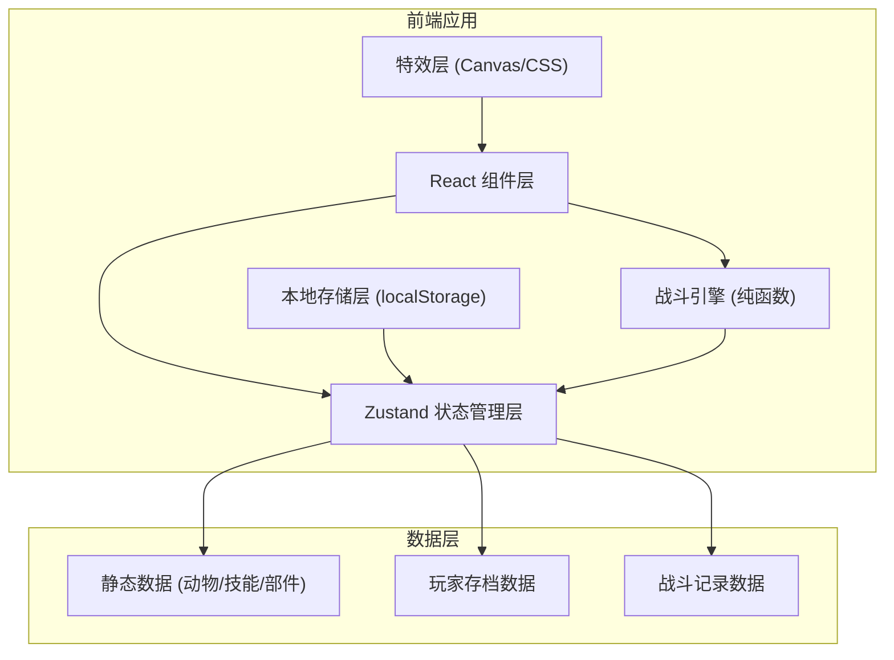
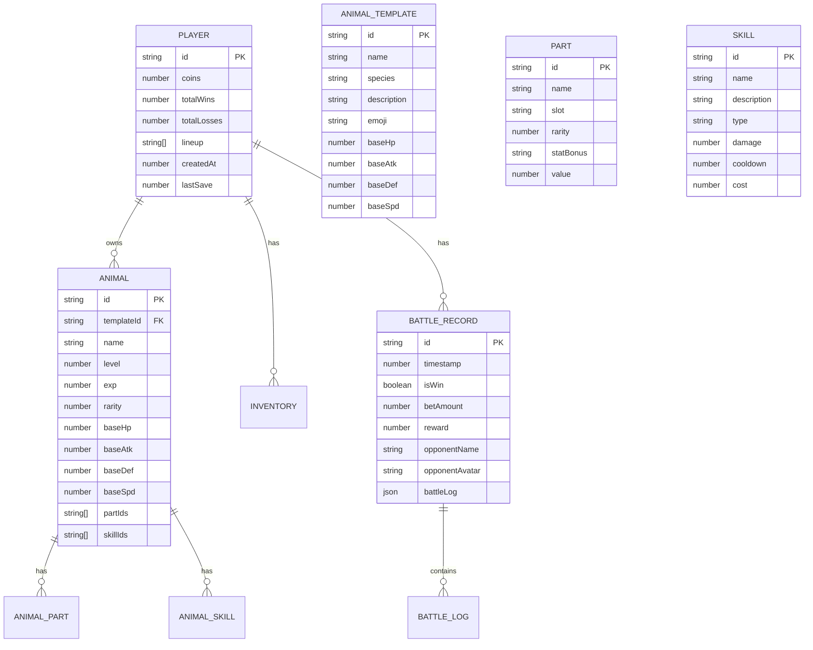

## 1. 架构设计



## 2. 技术描述

- **前端框架**：React@18.3 + TypeScript@5.8
- **构建工具**：Vite@6.3
- **状态管理**：Zustand@5.0
- **样式方案**：TailwindCSS@3.4 + 自定义霓虹主题
- **路由管理**：React Router@7.3
- **图标库**：Lucide React
- **工具库**：clsx、tailwind-merge
- **数据存储**：localStorage（无后端，纯前端）
- **动画方案**：CSS Animations + Canvas 2D 粒子特效

## 3. 目录结构

```
src/
├── components/           # 通用组件
│   ├── NeonButton.tsx    # 霓虹按钮
│   ├── NeonCard.tsx      # 霓虹卡片
│   ├── AnimalCard.tsx    # 动物卡片
│   ├── BattleUnit.tsx    # 战斗单位
│   ├── HealthBar.tsx     # 血条组件
│   ├── SkillIcon.tsx     # 技能图标
│   ├── PartSlot.tsx      # 部件槽位
│   ├── EffectLayer.tsx   # 特效层
│   ├── DamageNumber.tsx  # 伤害飘字
│   └── NavBar.tsx        # 导航栏
├── pages/                # 页面组件
│   ├── Home.tsx          # 首页-斗兽场大厅
│   ├── Lineup.tsx        # 阵容编辑
│   ├── Skills.tsx        # 技能配置
│   ├── Battle.tsx        # 战斗页面
│   ├── Replay.tsx        # 战斗回放
│   └── Shop.tsx          # 商店/抽取
├── store/                # Zustand 状态管理
│   ├── useGameStore.ts   # 游戏主状态
│   ├── useBattleStore.ts # 战斗状态
│   └── useReplayStore.ts # 回放状态
├── engine/               # 战斗引擎
│   ├── types.ts          # 类型定义
│   ├── constants.ts      # 常量配置
│   ├── battleEngine.ts   # 战斗逻辑
│   ├── ai.ts             # AI对手生成
│   └── damageCalc.ts     # 伤害计算
├── data/                 # 静态数据
│   ├── animals.ts        # 动物数据
│   ├── skills.ts         # 技能数据
│   ├── parts.ts          # 部件数据
│   └── opponents.ts      # 对手模板
├── hooks/                # 自定义Hooks
│   ├── useLocalStorage.ts # 本地存储Hook
│   ├── useAnimation.ts   # 动画Hook
│   └── useBattleTick.ts  # 战斗时钟Hook
├── utils/                # 工具函数
│   ├── id.ts             # ID生成
│   ├── random.ts         # 随机工具
│   ├── format.ts         # 格式化工具
│   └── save.ts           # 存档工具
└── types/                # 全局类型定义
    └── index.ts
```

## 4. 路由定义

| 路由 | 页面 | 用途 |
|-----|------|------|
| `/` | Home | 斗兽场大厅首页 |
| `/lineup` | Lineup | 阵容编辑页面 |
| `/skills` | Skills | 技能配置页面 |
| `/battle` | Battle | 自动战斗页面 |
| `/replay` | Replay | 战斗回放列表 |
| `/replay/:id` | Replay | 具体战斗回放 |
| `/shop` | Shop | 商店/抽取页面 |

## 5. 数据模型

### 5.1 数据模型定义



### 5.2 核心类型定义

```typescript
// 动物
interface Animal {
  id: string;
  templateId: string;
  name: string;
  level: number;
  exp: number;
  rarity: 1 | 2 | 3 | 4 | 5;
  baseHp: number;
  baseAtk: number;
  baseDef: number;
  baseSpd: number;
  parts: EquippedPart[];
  skills: EquippedSkill[];
}

// 部件
interface Part {
  id: string;
  name: string;
  slot: 'head' | 'body' | 'limbs' | 'weapon' | 'core' | 'special';
  rarity: 1 | 2 | 3 | 4 | 5;
  stats: {
    hp?: number;
    atk?: number;
    def?: number;
    spd?: number;
  };
  emoji: string;
}

// 技能
interface Skill {
  id: string;
  name: string;
  description: string;
  type: 'attack' | 'defense' | 'heal' | 'buff' | 'debuff' | 'special';
  damage: number;
  cooldown: number;
  cost: number;
  effect: SkillEffect;
  emoji: string;
}

// 战斗单位状态
interface BattleUnit {
  id: string;
  animalId: string;
  name: string;
  maxHp: number;
  currentHp: number;
  atk: number;
  def: number;
  spd: number;
  skills: BattleSkill[];
  isAlive: boolean;
  side: 'player' | 'enemy';
  position: number;
}

// 战斗日志
interface BattleLogEntry {
  timestamp: number;
  type: 'attack' | 'skill' | 'damage' | 'heal' | 'death' | 'buff' | 'debuff' | 'victory';
  sourceId: string;
  targetId?: string;
  skillId?: string;
  value?: number;
  isCrit?: boolean;
  message: string;
}

// 战斗记录
interface BattleRecord {
  id: string;
  timestamp: number;
  isWin: boolean;
  betAmount: number;
  reward: number;
  opponentName: string;
  opponentAvatar: string;
  playerLineup: string[];
  enemyLineup: string[];
  battleLog: BattleLogEntry[];
}
```

## 6. 战斗引擎设计

### 6.1 战斗流程

1. **初始化**：根据双方阵容创建战斗单位，计算最终属性
2. **速度排序**：根据所有单位的速度值决定行动顺序
3. **回合循环**：
   - 按速度顺序依次行动
   - 检查技能冷却，选择可用技能/普攻
   - 计算伤害（考虑攻击、防御、暴击、属性克制）
   - 应用伤害/治疗效果
   - 检查是否有单位死亡
   - 检查胜负条件
4. **战斗结束**：判定胜负，发放奖励，保存战斗记录

### 6.2 伤害计算公式

```
基础伤害 = 攻击力 - 防御力 * 0.5
暴击判定 = random() < 暴击率（基础15%）
暴击伤害 = 基础伤害 * 1.8
最终伤害 = 暴击 ? 暴击伤害 : 基础伤害
最终伤害 = max(1, 最终伤害 * (1 ± 随机浮动0.1))
```

## 7. 状态管理设计

### 7.1 GameStore（游戏主状态）

```typescript
interface GameState {
  player: {
    id: string;
    coins: number;
    totalWins: number;
    totalLosses: number;
  };
  animals: Animal[];
  inventory: {
    parts: Part[];
    skills: Skill[];
  };
  lineup: string[]; // 出战动物ID数组
  battleRecords: BattleRecord[];
  actions: {
    loadSave: () => void;
    saveGame: () => void;
    addAnimal: (animal: Animal) => void;
    updateLineup: (ids: string[]) => void;
    equipPart: (animalId: string, partId: string, slot: string) => void;
    equipSkill: (animalId: string, skillId: string, index: number) => void;
    addCoins: (amount: number) => void;
    spendCoins: (amount: number) => boolean;
    addBattleRecord: (record: BattleRecord) => void;
    gachaAnimal: () => Animal;
    resetGame: () => void;
  };
}
```

### 7.2 BattleStore（战斗状态）

```typescript
interface BattleState {
  status: 'idle' | 'preparing' | 'fighting' | 'finished';
  playerUnits: BattleUnit[];
  enemyUnits: BattleUnit[];
  currentTurn: number;
  actionQueue: BattleLogEntry[];
  currentLogIndex: number;
  betAmount: number;
  isWin: boolean;
  actions: {
    startBattle: (playerLineup: Animal[], bet: number) => void;
    nextTick: () => void;
    executeAction: (log: BattleLogEntry) => void;
    finishBattle: (isWin: boolean) => void;
    resetBattle: () => void;
  };
}
```

## 8. 存档系统

### 8.1 localStorage Key

```
neon_colosseum_save_v1
```

### 8.2 自动存档时机

- 每次战斗结束后
- 阵容/技能/部件变更后
- 货币变动后
- 页面关闭前（beforeunload）

### 8.3 存档结构

```typescript
interface SaveData {
  version: string;
  player: {
    id: string;
    coins: number;
    totalWins: number;
    totalLosses: number;
  };
  animals: Animal[];
  inventory: {
    parts: Part[];
    skills: Skill[];
  };
  lineup: string[];
  battleRecords: BattleRecord[];
  createdAt: number;
  lastSave: number;
}
```

## 9. 性能优化

- 使用Zustand的selector避免不必要重渲染
- 战斗特效使用Canvas 2D而非DOM操作
- 列表使用React.memo优化
- 战斗日志虚拟滚动（超过100条时）
- localStorage操作节流，避免频繁写入
